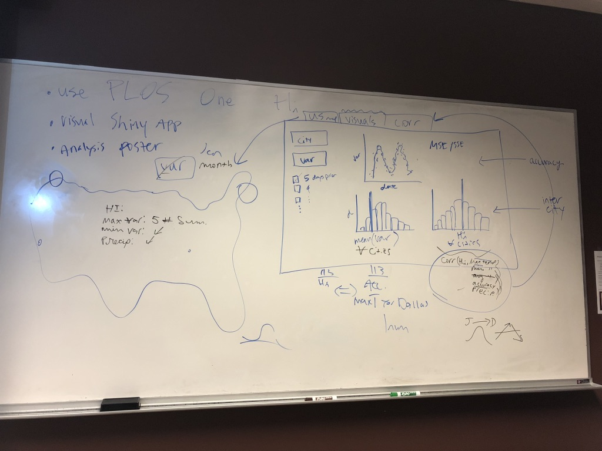
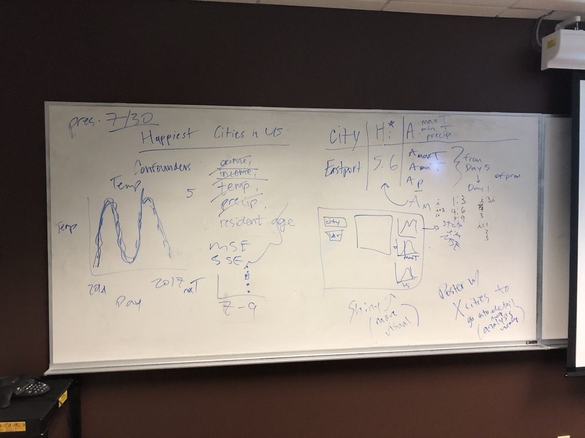

#Some Details

##Shiny App
- 3 main pieces, a US Map, general plots, and correlation analysis
- US Map:
    - provide summary statistics for each city on click
    - can filter by month and by variable
    - the size of markers will be by $H_i$ (happiness index)
    - $H_i$ [source in PLOS One](http://journals.plos.org/plosone/article/file?id=10.1371/journal.pone.0064417&type=printable)
    
- Visualizations: 
    - **scatter plot** of historical values for selected variables over time
        - add prediction lines for forecast's number of days prior
    - **histogram** of the mean of selected variable, with indicator for selected city
    - **histogram** of $H_i$, with indicator for selected city
    
- Correlation:
    - find correlation between $H_i$ and summary statistics of the selected variable, by city

---

#Rough Ideas:

---

